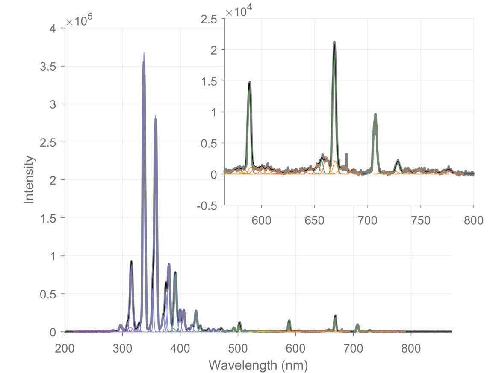
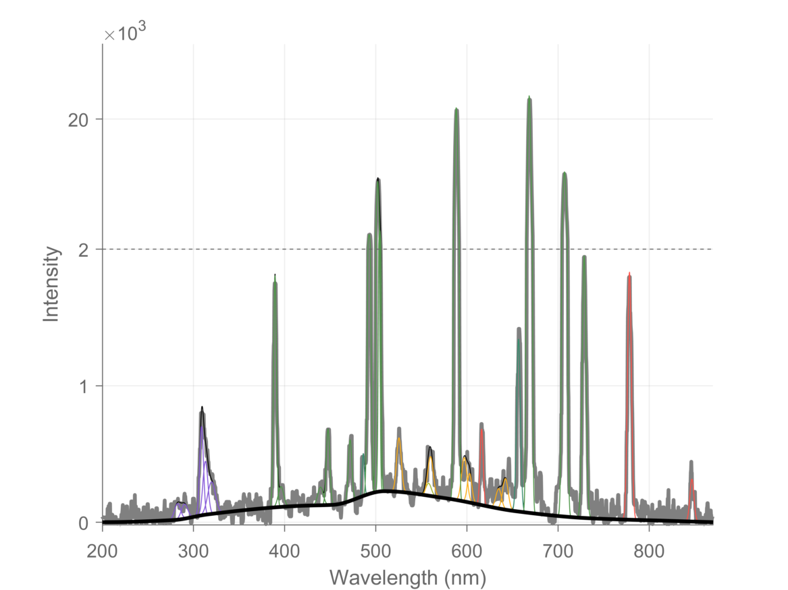

# Plasma Spectrum Fitting
Matlab classes for fitting low resolution optical emission spectrum of atmospheric pressure plasma jets

## Example usage
 

```Matlab
% Load the example SpectralLines object
%  - This object has emission groups for the following species
%      H, He , O, O2+, NO, OH, N2_1PS, N2_2PS, N2_1NS, OH2
%    as well as two groups with lines that were not identified
%      Unknown_N2_related, Unknown_O2_related.
%  - Note the emission lines in these groups are simply the lines that were
%    observed in the emission spectrum of our plasma source.
load('specLines.mat')
show(specLines) % Display the different EmissionGroups and their emission lines

% Load two different example spectrum.
%  - The first spectrum is from a He plasma jet surrounded with N2 and in
%    contact with a liquid surface.
%  - The second spectrum is from a He plasma jet surrounded with O2 and in
%    contact with a liquid surface.
load('exampleSpectra.mat')

% Fit the spectra with N2, and do not include the O2 related emission groups
% while fitting
groups_to_use = ~contains(specLines.names, "O2");
[p, group_idx] = specLines.fit(x1,y1, groups_to_use);

% Plot the spectrum and the fit
%  - This will result in the figure on the left above.
figure
line(x1,y1,'Color',0.5*[1 1 1],'LineWidth',2)
specLines.plotfit(x1, p, group_idx)

% Fit the spectra with O2, and do not include several of the N2 related
% emission groups while fitting
% - Note: The O2 spectra observed have a continuous background emission.
%   This background must be taken into account to correctly fit the spectrum.
%   The fit function already has an empirical profile for this continuous
%   background. Note that the background is specifically for the spectrum
%   observed in our experiments using O2 surrounding the He jet, and is not
%   necessarily general.
groups_to_use = ~contains(specLines.names, ["N2_1PS", "Unknown_N2", "N2+""]);
fit_O2_background = true;
[p, group_idx, fitter] = specLines.fit(x2,y2, groups_to_use, fit_O2_background);

% Plot the spectrum and the fit
%  - This will result in the figure on the right above.
figure
line(x2,y2,'Color',0.5*[1 1 1],'LineWidth',2)
background = fitter.bg; % extract the fit background.
specLines.plotfit(x2, p, group_idx, background)

% For more detailed plotting, see example.m located in the example folder
```

## Description
The code works by performing a constrained minimization of the difference between a model spectrum and an experimental spectrum. The model spectrum is created using a set of Guassians at wavelengths specified by the user.

The spectral lines of the model are divided into different groups. Each group can represent the emission lines of a single species (i.e. He emission lines, or atomic O emission lines, or NO emission lines, ...), or more generally, a group can be any set of lines could be dependent on one another. For example, the amplitude of each emission line of the Nitrogen 1st positive system (N<sub>2</sub><sup>1PS</sup>) should generally be within some percent of the lines around it; thus, these emission lines can be grouped together.

Each of these different groups are contained in an instance of the class `EmissionGroup`, and all of the different groups are contained in an instance of the class `SpectralLines`.

### `SpectralLines`
The class `SpectralLines` contains all the different `EmissionGroup`s used to fit an experimental spectrum. `SpectralLines` contains the method of fitting an experimental spectrum:

```Matlab
  % fit()
  %
  % Input -
  % x : wavelength values of the experimental spectrum
  % y : intensities of the experimental spectrum
  %
  % Output -
  % gauss_params : n x 3 array, each row gives (A, mu, sig^2) for a gaussian
  % group_idx : n x 1 array, where the i'th value gives the EmissionGroup index
  %   that the gauss_params(i,:) belongs too.
  [gauss_params, group_idx] = fit(SpectralLines_obj, x, y)
  [gauss_params, group_idx] = fit(SpectralLines_obj, x, y, groups_to_use)
```
as well as several other useful methods

```Matlab
  obj = addGroup(obj, group_name, group_lines_wavelengths) % Add a new EmissionGroup
  obj = addLine(obj, group_name, line_wavelength) % Add a line to an EmissionGroup
  show(obj) % display the name and lines of each EmissionGroup

  % Plot the emission lines to a figure. Clicking on one of the plotted lines
  % will display the group to which the line belongs as well as its wavelength
  plot(obj)
  plot(obj, ax, groups_to_plot)

  % Plot the gaussians returned by the fit() function
  plotfit(obj,wavelengths, gauss_params, group_idx)
```

More details can be found by studying the example SpectralLines class included (`specLines.mat`) and the `EmissionGroup`s contained in it.

### `EmissionGroup`
The class `EmissionGroup` contains a list of the emission lines belonging to the group, and it contains a function handle, `nonLinFitConstraint()`, for the non-linear constraints to apply to the lines of the group. The output of this function to be the same as is expected for the non-linear constraint functions used by Matlab's `fmincon()`, which this program uses.

`nonLinFitConstraint()` should take in two arguments `(p, idx)`, where `p` is a list of all of the gaussian parameters for all of the `EmissionGroups` in a `SpectralLines` object, `idx` is a logical array indicating which gaussians belong to this specific `EmissionGroup`. These two parameters are automatically computed for you in the `fit()` function of `SpectralLines`. If your constraint function needs additional parameters, then simply use an anonymous function: examples of this, and constrain functions, can be seen in the OH, N2_1PS, and N2_2PS, `EmissionGroup`s provided in the example `SpectralLines` class, `specLines.mat`, as well as the constraint functions `OH_Constraint.m`, `N2_1PS_Constraint.m`, and `N2_2PS_Constraint.m`.

This class additionally contains the initial Gaussian sigmas, `s0`, as well as two parameters `dc` and `ds` that control how much each line is allowed to move when fitting, `dc`, and how much the Gaussian sigma is allowed to change when fitting `ds`.

More details can be found by studying the `EmissionGroup.m` file and the example files provided.
